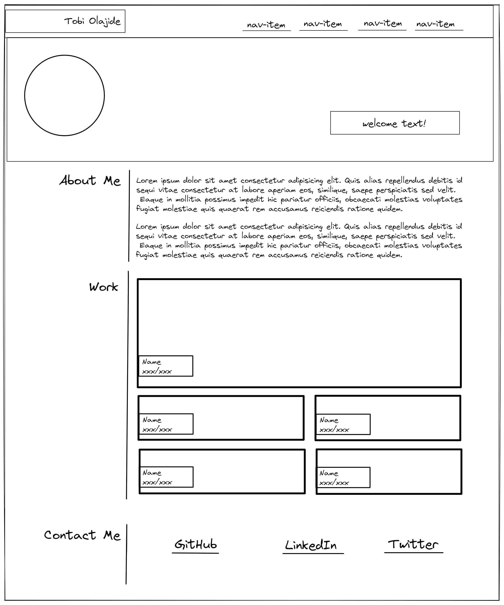

# My Portfolio

## Description 

### User Story

```
AS A web devoloper being able to showcase my skills to potential employers is an important aspect of getting recruited
I WANT a portfolio of work which highlights my strongest work with links to deployed applications
SO THAT recruiters can easily view and access my proficiency as a web developer.
```

### Acceptance Criteria

```
* When the page is loaded the page presents my name, a recent photo, and links to sections about me, my work, and how to contact me
* When one of the links in the navigation is clicked then the UI scrolls to the corresponding section
* When viewing the section about my work then the section contains titled images of my applications
* The size of my first application must be larger than others in the work section
* When images of the applications are clicked then the user is taken to that deployed application
* When the page is resized or viewed on various screens and devices then the layout is responsive and adapts to my viewport
```

### Wireframe



## Table of Contents

* [Description](#description)
* [Usage](#usage)
* [Credits](#credits)
* [License](#license)

## Usage 

### Deployed Application

* The URL of the deployed application:
[https://thorbieey.github.io/Portfolio-OT/](https://thorbieey.github.io/Portfolio-OT/)

* The URL of the GitHub repository: 
[https://github.com/Thorbieey/Portfolio-OT.git](https://github.com/Thorbieey/Portfolio-OT.git)

Also, find below a demo of the webpage


## Credits

* [Read up on Flexbox](https://developer.mozilla.org/en-US/docs/Learn/CSS/CSS_layout/Flexbox)
* [Read up on Grid layout](https://www.w3schools.com/tags/att_img_alt.asp)
* [Take a shot at designing your own wireframe](https://excalidraw.com/)
* [Learn cool tricks about blending an elements background](https://developer.mozilla.org/en-US/docs/Web/CSS/background-blend-mode)

## License

Licensed under the [MIT](https://choosealicense.com/licenses/mit/) license